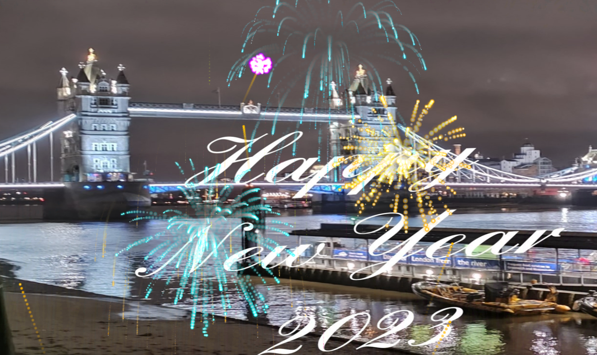

# Happy New Year

As a student, I wanted to wish my classmates, teaching assistants and my professor  a happy new year in a style.

# Description

Creating  a New Year msg using jquery pluggins, HtML , CSS and Java and jQuery codes.

# Getting Started

Step 1
Created an image with  Happy New Year 2023 written on it.

Step 2
Using style.css  gave position to the image on the page.

Step 3
Downloaded jquery pluggin of firework. Extracted the file and put it in the same folder (Happy New Year). Then linked the extracted file in index.html file.

Step 4
Followed the steps on jquerry plugin page (https://www.jqueryscript.net/animation/jQuery-Plugin-To-Create-Canvas-Based-Fireworks.html) This is what it looks like 
Step 5
Downloaded and attached the audio to index.html file. Audio is launching but when refreshing it, it doesnt launch, not sure whats wrong.

# Conclusion

Learned few new things and thoroughly enjoyed doing this. Need to explore more with the plugins, pretty neat feature. 
Link to my site https://najma53.github.io/New-Year-Greetings/

